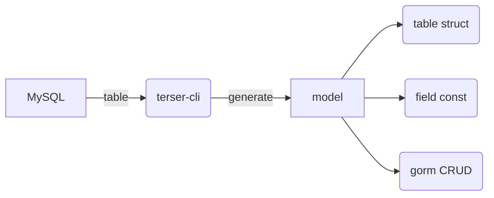
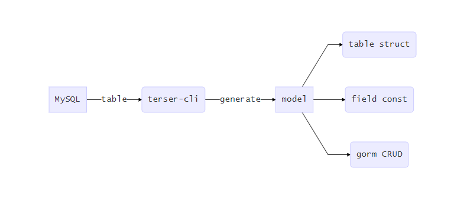

# terser-cli

----------
一个Golang代码生成工具





## 功能说明


- 表结构Model
- 表字段const
- 集成gorm相关CRUD操作
- 支持多主键
- 支持数据库null类型

## 使用说明

### 使用命令生成代码

1. 下载go源码
	
> go get -u github.com/tersergo/terser-cli

2. 执行生成命令

```sh
# 查看命令参数
terser-cli -help
# 执行枉顾test库
terser-cli -name=test -dsn="root:root@tcp(localhost:3306)/test?charset=utf8&parseTime=True&loc=Local" -driver=mysql -app=new-app
```
- -name: 数据库名称
- -dsn: 数据源地址
- -driver 数据库驱动名(MySQL, SQLite3, Postgres, MSSQL)
- -app: 应用或项目名称
- -unsigned: 是否支持无符号(uint)类型(默认1支持,0为忽略)

### 在项目中使用生成代码

- 将代码复制到项目
- 安装依赖库

```sh
go get -u github.com/jinzhu/gorm
go get -u github.com/guregu/null
```


